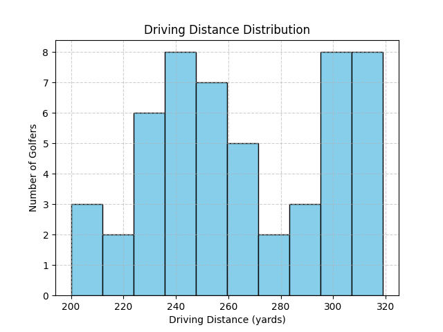

# Introduction

## Motivation:

Artificial Intelligence (AI) has become a transformative tool across many domains. From healthcare and finance to education and sports [@Zhou2025_AIinSportNarrativeReview]. On the other hand, in many of these fields, the power and availability of data have improved our ability to read and interpret it correctly. In the realm of sports analytics, many athletes and coaches are increasingly relying on digital tracking tools that can record thousands of performance metrics. However, only a few systems provide actionable insights that are tailored to individual athletes and coaches based on individual data. 

In golf, a clear example of this gap can be seen in data collection and interpretation. There are technologies such as wearable sensors, specifically, GPS trackers, and other advanced club monitoring devices; golfers today can measure nearly every part of their game performance. Key metrics that my tool uses include driving distance, approach accuracy, putting consistency, and greens hit in regulation (GIR). 

- Greens in regulation (GIR) refers to reaching the green on a golf course in the set number of strokes, which is two strokes less than par.
- An approach shot is when a golfer attempts to reach the green from the fairway or rough.
- A handicap in golf is a numerical measure of the player's scoring ability and is used to compare skill level with other players.

These metrics are accessible through their own observation, tools, or sensors. Most golfers, whether they are playing competitively or just recreationally, come across similar challenges: they see the data, but struggle to understand and apply it in order to improve at the game of golf. Having access to performance data without knowing how to use it is a main reason a lot of golfers struggle to improve. [@Rahmani2024_ApplicationAIinSportsIndustry].

CaddySense can bridge this gap. Instead of functioning only as a metric tracking platform, this tool is an AI-powered golf performance assistant that combines data analysis, dynamic visualizations, and conversational AI improvement coaching. The goal is not only to display statistics, but to convert them into personalized feedback and provide suggestions based on each golfer's trends in their golf profiles. These steps provide meaningful insight needed for personalized improvement. By using quantitative metrics to derive these insights, CaddySense transforms golfers' true performance data into meaningful feedback, rather than just showing players their data with no guidance. This work is mainly motivated by two main observations: 

- Data with no coaching gives limited value and meaning. Many current systems that track data focus on measurement, not interpretation. This ignores the equally important explanation and guidance aspect.
- Personalized coaching is often not easily accessible. Lessons from teaching professionals can be often times expensive or limited in availability, which leaves a majority of players without personal guidance, which means no access to customized, data-backed insights.
	
Compared to typical golf tracking apps that are able to emphasize statistics without explanation or feedback, CaddySense is made to support interpretation, which is key in order to help golfers understand why certain results are occurring and also how they can improve based on their previous performances. This project plays a role in making a positive step in the right direction regarding human focus and how AI can be used to interpret data in sports. CaddySense also shows how data analysis and large language models (LLMs) can exist and produce contextual and personalized coaching.

## Current State:

The world of sports analytics has evolved significantly over the past two decades. The company’s tools, such as Arccos, TrackMan, and ShotScope, allow players to capture detailed performance data; however, these respective products often stop short of providing clear and personalized advice [@Mateaus2024_EmpoweringSportsScientistAI]. They focus more on descriptive analytics, which focus on answering a question of “What happened?”, rather than descriptive analytics such as “What to do next?”. At the same time, artificial intelligence has shown great potential in personalized fitness and performance. Recent research, including studies such as “AI in Digital Sports Coaching” (2024) and “Uses of Artificial Intelligence in Personalizing Sports Training” (2025), shows how machine learning models can use and read biometric and contextual data in order to give specific recommendations. Although most systems remain missing important details as they are succeeding in providing cloud-based models, they lack transparency, and have no user control [@Jud2024_AIinDigitalSportsCoaching], [@Li2025_AIinSportsTechnologiesReview].

### System Architecture

CaddySense is implemented as a local desktop application for data analysis, not a wearable device or a cloud-dependent service. This tool builds on this by focusing on local computation, interpretability, and ethical structure. All the computation is done by using a local database storage, analytics, and AI advice, all performed locally from the user’s device. Future versions of CaddySense may become available as a mobile app; however, the current prototype was designed only to show accessibility and to show an offline system that is able to be private, and gives the user ownership. Some of the main features that make up the overall structure of CaddySense include: 

- Structured Storage of data: Using SQLite ensures a database is secure and stores each player’s performance statistics. This makes sure that they have full control over the system without using external servers, as well as knowing that their data is safe and secure.
- Analytical model: With a Python analytical model, the program uses the stored data to make visuals to show trends in metrics like driving distance, putting accuracy, and greens in regulation (GIR).
- AI coaching ability: An assistant able to have an educational conversation with golfers, powered by Ollama’s Phi-3 model, interprets data profiles to provide expert personalized feedback. This supports more natural language interaction. For example, a question might be, “How can I improve my putting?” and then the program will interpret the question based on the golfer’s metrics and give an evidence-based response.

This combination of data analysis and conversational AI separates CaddySense from traditional systems. As shown in figure 1, this is both an engine that is analytical and a communicational interface, designed in order to make performance data meaningful and attainable. When these components are put together, they form a data flow that combines analytical precision with communication intelligence. The overall system structure, shown in Figure 1.1 (System Architecture Diagram) below, shows this data flow:

- User Input: players can enter their performance metrics
- SQLite Database: Stores performance information in a secure, local way.
- Data Analyzer: Creates visual summaries of the players' measures, such as histograms, accuracy scatter plots, or radar charts, which are all used to highlight trends.
- AI Coach: Uses a local LLM (Phi-3 using Ollama) to interpret metrics and visuals, contributing to golfer-specific explanations and feedback.
- Recommendation Output: Tells the user the next steps and coaching ideas based on their specific performance patterns.

This structure is able to support adaptability, reproducibility, and user trust, which are all qualities that are essential to ensure an ethical, sound, data-driven coaching system. By integrating these interpretable analyses using conversational AI, CaddySense is different from tools that already exist, acting not just as a tracker for statistics, but as an intelligent “caddy” that can be relied on for performance improvement.

## Goals of the Project:

The overall goal of this project is to develop and evaluate an interpretable AI system that will help golfers improve their performance by transforming data into personalized, data considered feedback. CaddySense looks to demonstrate how explainable AI can improve accessibility, trust, and engagement within sports analytics. 

The project starts out with a structured dataset, which is accomplished through SQLite, making sure that the storage is organized, and contains the metrics listed as driving distance, handicap, approach accuracy, greens in regulation, and putting averages. These measures are key factors and allow for a basic understanding of where the golfer is at skill-wise. 

A model that is prototyped in Python, then generates visual summaries that show the user's performance trends. The visuals that are seen in figures 2 and 3, can range from histograms, scatter plots, and radar charts, and their purpose is to act as another layer to help the user understand their strengths and weaknesses. These visuals are a good way to display multiple areas of reasoning about a golfer’s game.

{width=50%}

{width=50%}

CaddySense runs off a local language model (Phi-3) to provide the conversational aspect of the project. Using Ollama, which is a model that runs fully on the device, allows users to ask questions. For example, “Why am I missing greens?” or “How can I become more consistent?” The AI “caddy” will respond to the asked question, while referencing the user’s personal metrics. This makes sure that the feedback remains specific, rather than generic.

Beyond these listed technical achievements, CaddySense will also add concepts by showing how the interpretable AI is able to make personal analytics more inclusive and human-based, allowing for a stronger direction and potential for a future mobile app-based route. This system also describes how open source and on-device computation can be used to reduce some barriers when it comes to advanced sports analytics, promoting things like equity for athletes without access to subscriptions.

Formal Contributions:

- A locally computed, interpretable AI system that can integrate quantitative metrics and conversational reasoning for a personalized golf performance advice tool.
- A mix between data analysis and visualization that links a player’s metrics to meaningful, attainable goals and insights.
- An ethical structure that emphasizes components like transparency and privacy in AI-backed coaching.
- A conceptual model that shows how interpretable AI can generalize beyond golf to other areas, such as health, education, and even fitness.

## Ethical Implications: 

CaddySense was developed with the purpose of explicitly paying attention to ethical responsibility. The choices of structure, from the storage of data to the AI-generated feedback, reflect all the main themes of transparency, privacy, and fairness. These are all the key ideas to keep in mind when designing a tool, and to ensure that users have full control over their private information.

### Information Privacy:

This tool currently performs all computations locally using Ollama and SQLite databases. No personal data is ever sent to cloud servers or other external APIs, or any other external servers. This makes sure that the user has complete control of their information and is able to look at, edit, or delete their data at any given time.

This design of making the data local is a clear difference from many commercial sports analytics tools, which often rely heavily on cloud infrastructure that would lead to their internal process being less accessible to users. CaddySense’s data is never uploaded or shared. The idea to store all user data locally was made with broader research emphasizing the importance of personal data and privacy in AI systems [@Huang2024_IntegrationAIinSportsCoaching].

### Information Accuracy and Reasoning: 

The AI aspect of the tool is totally powered by Ollama’s Phi-3 model, which entirely runs on the device. Since all interpretation is done locally, all recommendations are made without exporting any personal metrics or information to outside AI systems. This design fully prevents privacy risks and allows users to understand and trust how their information is handled and how their insights are produced.

The system is built to be transparent in the way that analytical relationships are used to generate recommendations. For example, if a golfer has a lower green in regulation, this means that they also have a weaker approach accuracy. This assumption can be made entirely based on metrics and not hidden behind assumed logic.

### Potential Misuse and Safety: 

Since CaddySense provides performance advice, and not medical advice, its use overall provides minimal physical risk. This tool does not replace professional instruction or expertise. On the other hand, misuse could potentially occur if users are relying solely on the AI when it comes to decision-making. In order to prevent this, the system emphasizes interpretive assistance, not just absolute authority. When reinforcing that AI in this case complements rather than replaces professional coaching, which keeps the integrity of coaching and teaching professionals in sports training.

### Data Collection and Equity:

CaddySense uses synthetic data for demonstration purposes, which ensures ethical testing without the use of personal identifiers. Future iterations, however, may use real data under explicit user consent. By focusing on open source use and on device computation, the tool is able to promote equity, which allows athletes to use it without commercial subscriptions to benefit from these advanced analytics. 

### Broader Impacts: 

This work overall contributes more to current conversations about responsible AI in sports technology. They do this by modeling ethical, but interpretable, and also user-centered design. CaddySense encourages transparency and accessibility in an emerging field like AI tools. Its structure could be seen beyond golf, and looked at as serving as a blueprint for other transparent, domain-specific AI assistance in things like fitness, education, and health monitoring. This promotes a future in human compatibility with AI resources, while still respecting ethics. 

## Chapter Summary:

This chapter introduced the motivation, project goals, and ethical background of CaddySense, a tool using AI AI-powered golf performance assistant that can transform raw golf player data into more meaningful, personalized advice to get better at the game of golf. This chapter highlights how, even though there is an upcoming expansion of sports analytics, current systems often stop at measurement rather than interpretation. To prevent this, CaddySense is in the position of an interpretable and conversational-based AI system that can fill this gap between data collection and insight. Helping golfers actually understand not only what happened when it comes to their game, but also why it occurred and how exactly they can improve.

This chapter also emphasized how CaddySense is clearly made up of many components, such as structured local data storage using SQLite, provides visuals through Python-based data handling, and a conversational coach, which is powered through Ollama. All together these elements can create an advice-giving tool, which uses player metrics such as driving distance, greens in regulation, and putting average. Then, take these things and give the user back a recommendation that is tailored to their skill level. Unlike existing apps, CaddySense focuses more on interpretability, ensuring that performance measures are not alone, but backed with context, which helps with improvement.

Another key idea of this chapter involved ethical responsibility. The tool is intentionally designed for transparency, local computation, and privacy for the user. All the information is kept and processed on the user’s device currently. This prevents external data from being exposed and maintains control over their personal records. Furthermore, the logic behind all the recommendations is found in transparent data connections. For example, recognizing that lower greens in regulation percentage implies that the golfer has a weaker approach accuracy. This helps users understand how their metrics are used for the types of courses they play on. These design choices collectively support trust and interpretability, which are the main ideas that are responsible for AI development in personalized analytics. 

Aside from the technical goals, CaddySense also reflects a vision of how artificial intelligence can complement, rather than replace, human coaching and expertise. Since this tool offers guidance without taking over all coaching, the system shows reflections of advice and gives the user more opportunities for decision-making. Its structure shows how conversational AI and modeling can exist together within one system. The system can educate the user, as well as it is also informative to them. As CaddySense has this balance between understanding and automation, the aim is to redefine how athletes from all levels are engaging with their performance data. 

In summary, this chapter set the foundations for CaddySense in terms of both technical systems and as an ethical mode for AI in sports. This project outlines the motivations behind an accessible, local, and insight-driven caddy assistant. CaddySense is also described how it is designed to be transparent and fair when generating AI feedback. The next chapter will expand on these ideas by showing examples of related works that back these themes and ideas that helped create CaddySense as a whole.
